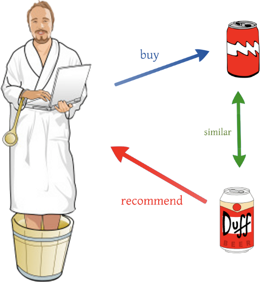
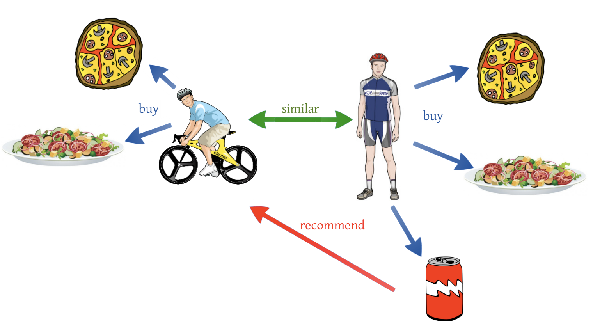
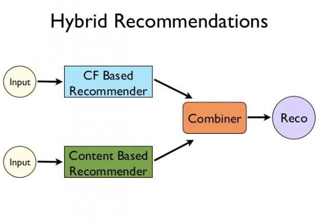
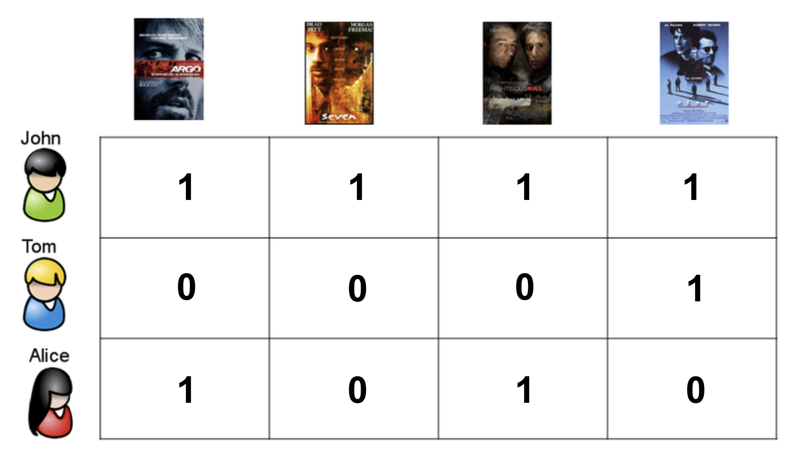
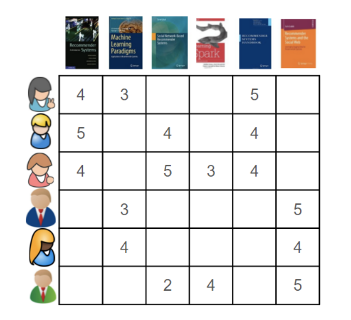
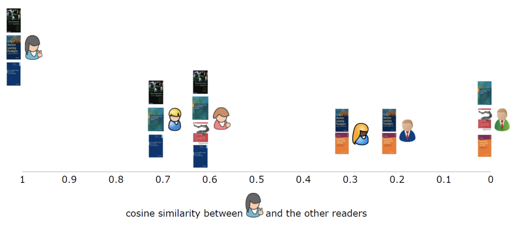
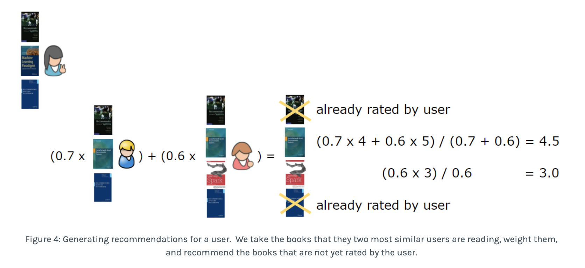
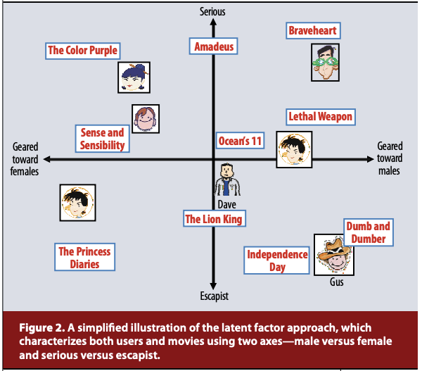
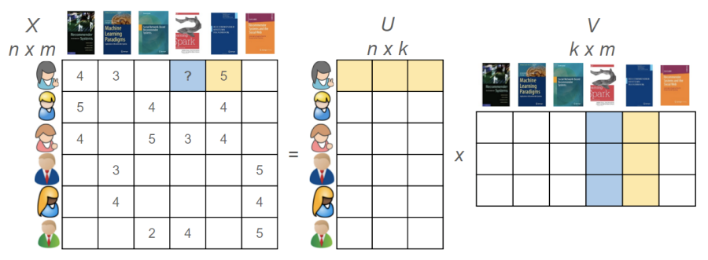
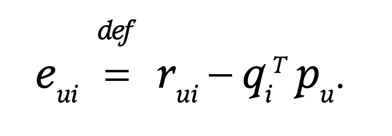

# 추천 시스템 Basics

**저자** 당근마켓 머신러닝 엔지니어 이웅원

**날짜** 2019.08.13

**Table of contents**

# 추천 시스템이란

**특정 사용자**가 **관심을 가질 만한 정보**를 추천하는 것이다. Information filtering의 일종이라고 볼 수 있다. 여기서 말하는 **관심**은 정의하기 나름이다. 아이템의 종류가 동영상이라면 동영상을 시청하는 것이 관심의 표현일 것이다. 아이템의 종류가 쇼핑에 관련된 제품이라면 구매나 장바구니에 넣는 것이 관심을 나타낸다. 얼마나 관심을 가지는지도 정의하기 나름이 된다. 유튜브의 추천 시스템은 다음 그림과 같이 메인피드에서 내가 볼 만한 동영상을 보여준다. 유튜브에서는 동영상을 시청한 시간을 관심의 척도로 사용한다.

[https://www.idownloadblog.com/2016/04/26/youtube-new-homepage-design/](https://www.idownloadblog.com/2016/04/26/youtube-new-homepage-design/)

특정 서비스에서 아이템의 수가 점점 많아지면서 사용자가 정보를 찾기가 어려워진다. 수많은 정보 속에서 사용자가 원하는 정보를 찾을 수 있는 방법에는 두 가지가 있다. **검색**은 query와 document 사이의 관계를 분석하는 것이라면 **추천**은 user와 item 사이의 관계를 분석하는 것이다. 

- **검색** : 사용자가 (관심 있는 아이템에 대한) query를 던지면 query와 관련이 많은 document list를 반환
- **추천** : 사용자의 이전 행동을 기반으로 관심 있을만한  아이템 리스트를 반환

query를 user라고 보고 document를 item이라고 본다면 검색과 추천은 상당히 비슷하다고 볼 수 있다. 실제로 learning to rank 라는 task는 검색과 추천 모두에 활용할 수 있다. 유튜브의 예를 들면 검색 버튼을 통해 원하는 동영상을 찾을 수도 있고 메인 피드에서 재미 있을만한 동영상을 클릭해서 볼 수 있다. 혹은 검색을 통해 나온 아이템을 선택하면 그 아이템과 비슷한 아이템을 추천할 수도 있다. 이렇게 검색과 추천은 서로 비슷하면서도 함께 사용해서 사용자가 좋아할만한 아이템을 더 잘 찾을 수 있게 도와준다.

추천 시스템을 크게 나누자면 다음 두 개가 있다.

- **content-based filtering** : user나 item은 자체의 특징으로 표현된다. 예를 들어 item이 음악이라면 음악의 제목, 가수, 장르 등이 item을 표현하게 된다. 사용자가 만약 재즈 음악을 들었다면 content-based filtering 은 사용자에게 다른 재즈 음악을 추천할 것이다. 실제로는 이렇게 간단하게 item을 표현하지는 않고 수백개 정도의 feature(?)로 표현한다. collaborative filtering은 user와 item 간의 행동을 분석하는 방법이라고 하면 content-based filtering은 item 자체끼리 비슷한지 비교하는 방법이다. Content-based filering에서 가장 많이 사용되는 방법은 TF-IDF 이다 (자연어처리 쪽에서 널리 사용되는 문장을 vector로 표현하는 방법이다). item을 하나의 vector로 표현한 다음에 clustering 알고리즘을 통해 item을 몇 종류의 cluster로 나눈다. 아래 그림 같이 user가 콜라를 선택했다면 콜라와 같은 cluster에 있는 Duff라는 음류수를 추천하는 것이다. content-based filtering은 과거의 user가 봤던 유형의 item만 추천하기 때문에 한계가 많다. 하지만 user-item iteraction 정보가 없어도 추천이 바로 가능하므로 cold-start 문제는 없다.

[http://dataconomy.com/2015/03/an-introduction-to-recommendation-engines/](http://dataconomy.com/2015/03/an-introduction-to-recommendation-engines/)

- **collaborative filtering** : 줄여서 CF라고 한다. CF는 user-item의 상호작용 정보를 통해 user가 좋아할 만한 item을 추천한다. 기본적인 개념은 user-item interaction 정보를 통해 비슷한 사용자를 찾고 내가 보지 않았지만 비슷한 사용자가 봤던 item을 추천하는 것이다. 이렇게 비슷한 user끼리 서로 어떤 item을 좋아할지 협력해서 filtering하기 때문에 이름이 collaborative filtering이다. CF은 content-based filtering과는 다르게 user나 item 자체의 특성을 추천에 사용하지 않는다. 아래 그림에서 피자와 샐러드라는 item을 user가 샀다고 하더라도 user에게는 그저 item1, item2일 뿐이다. CF는 item 자체의 'content'를 모르고 추천하기 때문에 더 많은 user-item interaction 데이터를 필요로 한다. user-user, item-item, user-item similiarity를 계산하기 위한 방법에는 KNN, pearson correlation 등이 있다.

[http://dataconomy.com/2015/03/an-introduction-to-recommendation-engines/](http://dataconomy.com/2015/03/an-introduction-to-recommendation-engines/)

- hybrid recommendation system : content-based filtering과 collaborative filtering은 장단점이 있기 때문에 두 방법을 합쳐서 사용하는 연구가 많이 진행됐다. 예를 들면 다음과 같이 두 모델에서 나온 추천을 섞어서 사용자에게 전달하는 방법도 있다.

참고 자료

[추천 시스템(Recommendation System)](https://khanrc.tistory.com/entry/%EC%B6%94%EC%B2%9C-%EC%8B%9C%EC%8A%A4%ED%85%9CRecommendation-System)

[추천 시스템](https://ko.wikipedia.org/wiki/%EC%B6%94%EC%B2%9C_%EC%8B%9C%EC%8A%A4%ED%85%9C)

[An Introduction to Recommendation Engines](http://dataconomy.com/2015/03/an-introduction-to-recommendation-engines/)

# Collaborative Filtering

추천 시스템은 최근에 위에서 언급한 CF 위주로 많은 발전을 이루었다. 누군가 추천 시스템을 만든다고 하면 우선 CF을 사용하라고 할 것이다. CF는 user-item interaction 데이터를 활용해서 추천을 하는 것이다. 하지만 user가 item에 interaction 하는지 (feedback) 데이터마다 다를 수 있다. 간단하게는 다음과 같다. 

- **explicit feedback** : item에 대한 user의 선호도를 직접적으로 알 수 있는 데이터이다. 영화 평점, 맛집 별점과 같은 피드백 데이터를 이야기한다. user가 직접 별점을 계속 매겨야하므로 데이터셋의 크기가 보통 작다.
- **implicit feedback** : 서비스에서 user한 행동을 기록한 것을 말한다. 예를 들면 뉴스 사이트에서 뉴스를 클릭한 기록이 될 수 있다. 클릭을 통해서 직접적으로 item에 대한 user의 선호도를 알 수 없기 때문에 implicit feedback이라고 한다. explicit feedback에 비해 데이터의 품질은 낮으나 데이터셋의 양이 보통 비교가 안될만큼 크기 때문에 최신 추천 시스템은 implicit feedback 데이터를 통해 추천하는 방향으로 발전했다.

[https://jinyi.me/2018/06/Recommendation-System-Miscellus/](https://jinyi.me/2018/06/Recommendation-System-Miscellus/)

CF의 학습에 주어지는 데이터의 형태는 user-item matrix이다. 다음 그림이 user-item matrix의 예시이다. 만약 데이터의 형태가 explicit feedback이라면 user가 영화에 대해 줬던 rating 값을 적는다. 이렇게 matrix를 만들고 나면 (?)로 비어있는 곳들이 있는데 이 비어있는 곳을 채우는 것이 CF의 목표라고 볼 수 있다. 따라서 이 문제를 matrix completion이라고 부르기도 한다. 빈 공간을 채웠다면 채운 숫자에 따라 사용자에게 추천할 수 있다. 

[https://www.researchgate.net/figure/Example-of-user-item-ratings-matrix-in-a-movie-recommendation-scenario_fig2_300646445](https://www.researchgate.net/figure/Example-of-user-item-ratings-matrix-in-a-movie-recommendation-scenario_fig2_300646445)

만약 implicit feedback라면 rating이 아니라 interaction이 있었다면 1이라고 적는다. interaction이 없던 곳은 0으로 채운다.  Explicit feedback 데이터셋에서는 rating 자체가 이미 item에 대한 선호도를 담고 있기 때문에 rating 안에 긍정적인 feedback과 부정적인 feedback 모두를 담고 있다. 하지만 implicit feedback 데이터셋에서는 오직 positive feedback 정보 밖에 없다. interaction이 일어난 positive feedback에 대해서만 학습한다면 user의 선호도를 학습하기가 어렵다. 따라서 implicit feedback 데이터셋에서는 'missing data'를 모두 잠정적인 negative feedback으로 보고 0으로 채운다. 따라서 implicit feedback 데이터셋으로 CF를 학습할 때는 matrix의 빈 공간을 채우는 것이 학습의 목표가 아니라 주어진 matrix에서 사용자의 선호 패턴을 알아내는 것이 목표가 된다.

구체적으로 어떻게 CF가 학습 하는지 알아보기 전에 CF가 공통적으로 안고 있는 문제는 다음과 같다. 이 이외에도 많은 문제가 있다.

- **cold-start problem** : CF를 기반으로 추천하려면 user나 item이나 충분한 수의 interaction 데이터가 있어야한다. 따라서 새로운 user가 추천을 받거나 새로운 item이 잘 추천되기 위해서는 여러 개의 iteraction이 쌓일 때까지 기다려야 한다. 즉, user-item matrix에서 새로운 user라는 row가 추가되거나 새로운 item이라는 새로운 column이 추가되었을 때 추천을 할 수 없는 문제이다. 이것을 cold-start 문제라고 부른다.
- **sparsity** : 실제 서비스에서는 user와 item이 수백만일 수 있는데 이러면 matrix는 상당히 sparse 해진다. Sparsity는 전체 matrix에서 비어있는 칸이 얼마나 되는지로 측정한다. CF는 sparsity가 0.97 정도 이하일 때 잘 작동한다는 이야기가 있다. Sparsity는 인위적으로 줄일 수도 있다. 예를 들어 일정 개수 이상 interaction이 있는 user와 item만 사용하는 식으로 sparsity를 줄일 수 있다.
- **diversity** : CF는 user의 past history를 사용해서 추천을 하기 때문에 비슷한 item만 계속 추천할 수도 있다. 당장은 user가 좋아하는 item을 보여주면 user가 좋아하겠지만 금방 실증날 것이다. 유튜브에서 강아지 동영상을 봤는데 그 이후로 메인 피드에 강아지만 나온다고 생각해보면 이해가 빠를 것이다. 길게 봤을 때 user의 retention에 안 좋은 영향을 준다. 따라서 추천 시스템은 user의 취향을 반영하면서도 다양한 item을 보여줘야 한다.

CF는 두 가지로 나뉘는데 memory-based와 model-based 방법이다. 하나씩 살펴보자. 

- **memory-based method** : 메모리 기반이라고 하면 표현이 좀 안 와닿을 수 있다. 데이터로 주어지는 user-item matrix를 그대로 다 활용해서 특정 user가 특정 item에 줄 rating을 예측하는 방법이다.
- **model-based method :** user-item matrix를 통해 model을 학습하고 예측은 이 모델을 사용해서 하는 방법이다. CF에서는 제일 유명한 방법인 matrix factorization이 model-based 방법에 해당한다.

### Memory-based method

user-item matrix가 주어졌고 특정 user i가 아직 interaction을 하지 않은 item j에 대한 rating을 예측하고 싶다고 해보자. memory-based 방법에서 기본적인 단계는 다음과 같다. 

- user i의 평균 예측 점수 구하기 (사람마다 점수 주는 평균이 다르므로)
- user i와 다른 user 들과 similarity를 구하기
- user i와 가장 유사한 k명 추출하기
- 다른 user 들이 item j에 대해 매긴 점수를 weighted sum
- user i와 위에서 계산한 weighted sum을 통해 최종 rating 예측

memory-based 방법을 예시를 통해 살펴보자. 예시는 다음 블로그에서 가져왔다.

[Overview of Recommender Algorithms - Part 2](https://buildingrecommenders.wordpress.com/2015/11/18/overview-of-recommender-algorithms-part-2/)

다음과 같이 사용자가 책에 대해 rating을 explicit하게 매긴 데이터가 주어졌다고 해보자. 

user-based CF에서는 user 사이의 similarity를 구해야 한다. user 사이의 similarity를 구하기 위한 방법에는 여러가지가 있는데 그 중에서 가장 대표적인 것이 pearson correlation이다. 두 명의 user가 함께 점수를 매긴 rating 정보를 통해 similarity를 구할 수 있다.

Pearson correlation이 아니라 cosine similarity를 통해서 유사도를 구할 수도 있다. Cosine similarity는 다음과 같은 식으로 구할 수 있다. Cosine similarity는 user나 item의 평균 rating을 계산하지 않아도 되기 때문에 계산적인 측면에서 pearson correlation 보다 더 효율적이다. 하지만 특정 사용자의 점수 기준이 너무 높거나 낮거나 또는 특정 아이템이 받는 점수가 평균적으로 너무 높거나 낮거나 할 때 유사도가 잘 계산이 안될 수 있다. 

위 similarity 식을 이용해서 추천을 하고자 하는 사용자와 다른 사용자 사이의 similarity를 구하고 정렬한다. 이렇게 다른 사용자들을 similarity에 따라 정렬을 했다면 그 중에서 가장 similarity가 높은 사용자들을 추려낸다. 

가장 비슷한 사용자를 추려냈다면 다음 식을 통해 rating을 예측할 수 있다. k는 nomaralizing factor라고 보면 되고 simil이 user 사이의 similarity 값이다. 

예를 들어 가장 비슷한 사용자 2명만을 이용해서 추천한다고 해보자. 이 사용자 2명이 본 책 중에 이미 추천 받을 사용자가 본 책을 빼고 rating을 예측한다. 다음 그림에서는 간단하게 하기 위해서 평균 rating 정보는 생략했다. 예측한 rating에 따라 가장 사용자가 좋아할 만한 책을 알아낼 수 있다. 

memory-based method는 matrix의 sparsity가 커지면 커질수록 잘 동작하지 않는 경향이 있다. 따라서 model-based method 쪽으로 연구는 이어지게 된다. 

### Model-based method

user-item matrix를 통해 model을 학습하는 방법이다. Matrix로부터 model이 학습하고 나면 추천을 할 때는 model만 있으면 된다. model-based CF는 memory-based CF에 비해 scalability와 추천 속도에서 장점이 있다. 대신 데이터셋 전체를 사용해서 추천 하는 것이 아니라 model만을 사용하기 때문에 추천이 정확하지 않을 수 있다는 단점이 있다. Model의 종류는 여러가지가 있다. Bayesian Network, Decision Tree, Latent Factor Models, MDP 등 다양하다. 여기서 살펴볼 것은 Matrix Factorization이라는 방법으로 Latent Factor Model의 일종이다. 

# Matrix Factorization

MF는 다음 논문을 참고했다. 

[https://datajobs.com/data-science-repo/Recommender-Systems-[Netflix].pdf](https://datajobs.com/data-science-repo/Recommender-Systems-%5BNetflix%5D.pdf)

MF는 latent factor 모델의 일종이다. Latent factor 모델이 하고자 하는 것은 item과 user를 20-100 정도의 vector로 표현하고자 하는 것이다. 이 vector는 데이터에서 나타나는 rating 패턴에 의해 학습되는 것이다. content-based 방법에서 item을 제목이나 장르, 가수 등으로 표현했다면 latent factor 모델에서는 interaction pattern으로부터 학습된, 기계가 이해하는 특징으로 표현한다. Latent factor는 interaction 정보를 포함하기 때문에 풍부하게 item이나 user를 표현할 수 있다.

Content-based method와는 또 다른 것이 item과 user의 latent factor는 vector의 dimension을 공유한다는 것이다. 다음 예제를 보면 이해가 더 쉬울 것이다. 다음 그림은 latent factor 모델을 단순화시킨 그림이다. 사람과 영화 모두 serious 축과 성별 축 상에서의 값으로 표현한다. 따라서 latent factor 모델에서는 user와 item의 latent factor가 각 dimension 마다 같은 의미를 지닌다. Latent-factor model에서는 user와 item factor의 dot-product 값을 측정하고 그 값이 크면 추천한다. 같은 공간 상에 있기 때문에 가능한 것이다.

다음 논문에서 Matrix Factorization에 대해 다음과 같이 설명한다. 이 설명에서도 보면 user와 item을 같은 latent factor space 상에 mapping 한다고 표현한다.

[https://datajobs.com/data-science-repo/Recommender-Systems-[Netflix].pdf](https://datajobs.com/data-science-repo/Recommender-Systems-%5BNetflix%5D.pdf)

    Matrix factorization models map both users and items to a joint latent factor space of dimensionality f, such that user-item interactions are modeled as inner products in that space

Matrix Factorization을 식과 그림으로 나타내는 것은 어렵지 않다. item latent factor matrix를 q라고 하고 user latent factor matrix를 p라고 한다면 user u의 item i에 대한 rating은 다음과 같은 식으로 표현할 수 있다. 

그림으로 보자면 원래 user-item matrix를 user의 latent factor matrix와 item의 latent factor matrix로 쪼개는 것이라고 볼 수 있다(matrix factorization 자체가 행렬을 인수분해 한다는 뜻이니까). 이 때, q와 p를 곱한 값으로 원래 user-item matrix를 만들어내야 하는데 그것이 MF 학습의 핵심이다.

[https://buildingrecommenders.wordpress.com/2015/11/18/overview-of-recommender-algorithms-part-2/](https://buildingrecommenders.wordpress.com/2015/11/18/overview-of-recommender-algorithms-part-2/)

MF의 objective function은 다음과 같이 정의할 수 있다. 목표는 원래 rating을 예측하는 것으로 loss function은 MSE error를 사용한다. MF 중에서 MSE error가 아닌 cross-entropy를 사용하는 경우도 있지만 일단 MSE error만 생각하자. 아래 식에서 k는 rating을 알고 있는 user, item pair를 의미한다. 만약 MSE error만 최소화하는 것으로 학습하면 쉽게 overfitting 될 것이다. 따라서 L2 regularization을 사용한다. 

위 objective function을 최소화하는 p와 q를 찾기 위한 방법이 2가지가 있다. 

### SGD(stochastic gradient descent)

머신러닝을 하는 사람이라면 SGD에 대해 잘 알고 있을 것이다. error를 왼쪽과 같이 쓴다면 p와 q는 오른쪽 식과 같은 식으로 업데이트 할 수 있다(위의 loss function을 편미분해서 뺀 것이다). 

### ALS(alternating least square)

아래 objective function에서 p와 q를 모르기 때문에 convex optimization이 아니다. 이 objective function을 convex하게 바꿔주는 방법이 ALS이다. 방법은 간단하다. p와 q 둘 중 하나를 고정하면 전체 식은 convex하게 된다. 따라서 p의 값(만약 q를 고정했다고 하면)은 optimal하게 결정된다. p와 q를 번갈아가면서 고정하고 업데이트를 하는 식으로 학습을 진행한다. 다음 objective function이 수렴할 때까지 그 과정을 반복하면 된다. 

SGD가 ALS보다 간단하고 빠른 경향이 있지만 ALS는 parallel하게 계산할 수 있다는 장점이 있다. ALS에 대한 자세한 설명은 'Collaborative Filtering for Implicit Feedback Datasets' 논문을 참고하면 된다. 

### Additional bias

MF는 user factor와 item factor의 단순 dot product로 rating을 표현하려고 한다. 하지만 특정 사용자는 평균적으로 모든 item에 높은 점수를 줄 수도 있다. MF의 objective function은 이런 점을 잘 반영하지 못한다. 따라서 user와 item에 대해 bias를 사용한다. user u가 item i에 매긴 rating에 대한 바이어스는 오른쪽 식과 같이 표현할 수 있다. 

user bias와 item bias 모두 학습 대상이기 때문에 objective function에서 포함해서 학습한다. 

### Code Review of SGD MF

SGD를 이용해서 학습하는 기본적인 MF에 대한 코드는 다음 글에 잘 소개되어 있다. 

[[Recommender System] - Python으로 Matrix Factorization 구현하기](https://yamalab.tistory.com/92)

P는 user latent matrix이고 Q는 item latent matrix이다. num_users는 사용자 수이고 num_items는 아이템의 수를 말한다. k는 latent factor의 dimension을 말한다. P와 Q는 normal distribution에 따라 parameter initialization을 해준다. R은 user-item matrix를 의미한다. 위에서 말한 것처럼 user, item, 그리고 모든 rating에 대한 bias를 사용한다. user와 item에 대한 bias는 user 수, item 수의 크기를 가진다. 또한 global bias는 상수이다. 원하는 epoch 만큼 학습을 하는데 각 epoch에서 0이 아닌 모든 rating에 대해서 loss를 미분해서 업데이트한다.

    def fit(self):
        """
        training Matrix Factorization : Update matrix latent weight and bias
    
        참고: self._b에 대한 설명
        - global bias: input R에서 평가가 매겨진 rating의 평균값을 global bias로 사용
        - 정규화 기능. 최종 rating에 음수가 들어가는 것 대신 latent feature에 음수가 포함되도록 해줌.
    
        :return: training_process
        """
    
        # init latent features
        self._P = np.random.normal(size=(self._num_users, self._k))
        self._Q = np.random.normal(size=(self._num_items, self._k))
    
        # init biases
        self._b_P = np.zeros(self._num_users)
        self._b_Q = np.zeros(self._num_items)
        self._b = np.mean(self._R[np.where(self._R != 0)])
    
        # train while epochs
        self._training_process = []
        for epoch in range(self._epochs):
    
            # rating이 존재하는 index를 기준으로 training
            for i in range(self._num_users):
                for j in range(self._num_items):
                    if self._R[i, j] > 0:
                        self.gradient_descent(i, j, self._R[i, j])
            cost = self.cost()
            self._training_process.append((epoch, cost))
    
            # print status
            if self._verbose == True and ((epoch + 1) % 10 == 0):
                print("Iteration: %d ; cost = %.4f" % (epoch + 1, cost))

self.gradient_descent를 통해서 p와 q 그리고 bias 들을 업데이트한다. 업데이트는 user, item pair 하나 하나에 대해 gradient를 구해서 한다. gradient_descent 함수는 다음과 같다. 만약 prediction을 구했다고 하면 prediction과 rating의 차이를 error로 정의한다. bias를 업데이트 할 때는 loss function을 bias로 미분해서 gradient를 구해서 업데이트한다. 

    def gradient_descent(self, i, j, rating):
        """
        graident descent function
    
        :param i: user index of matrix
        :param j: item index of matrix
        :param rating: rating of (i,j)
        """
    
        # get error
        prediction = self.get_prediction(i, j)
        error = rating - prediction
    
        # update biases
        self._b_P[i] += self._learning_rate * (error - self._reg_param * self._b_P[i])
        self._b_Q[j] += self._learning_rate * (error - self._reg_param * self._b_Q[j])
    
        # update latent feature
        dp, dq = self.gradient(error, i, j)
        self._P[i, :] += self._learning_rate * dp
        self._Q[j, :] += self._learning_rate * dq

prediction은 다음 수식을 코드로 구현한 것이다. 

    def get_prediction(self, i, j):
        """
        get predicted rating: user_i, item_j
        :return: prediction of r_ij
        """
        return b + b_P[i] + b_Q[j] + P[i, :].dot(Q[j, :].T)

user latent factor와 item latent factor의 gradient는 다음과 같이 구한다. loss 식을 p와 q에 대해서 편미분해서 구한 것이다. 

    def gradient(self, error, i, j):
        """
        gradient of latent feature for GD
    
        :param error: rating - prediction error
        :param i: user index
        :param j: item index
        :return: gradient of latent feature tuple
        """
    
        dp = (error * self._Q[j, :]) - (self._reg_param * self._P[i, :])
        dq = (error * self._P[i, :]) - (self._reg_param * self._Q[j, :])
        return dp, dq

cost는 단지 실제 rating과 prediction의 차이가 얼마나 나는지 보는 것으로서 원래 Loss 식에서 regularization term을 뺀 값이라고 볼 수 있다. 매 epoch 마다 cost를 측정하면서 cost가 수렴하면 학습을 멈춘다. 

    def cost():
        xi, yi = R.nonzero()
        predicted = get_complete_matrix()
        cost = 0
        for x, y in zip(xi, yi):
            cost += pow(R[x, y] - predicted[x, y], 2)
        return np.sqrt(cost) / len(xi)